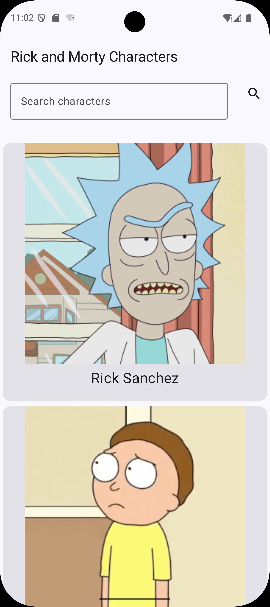
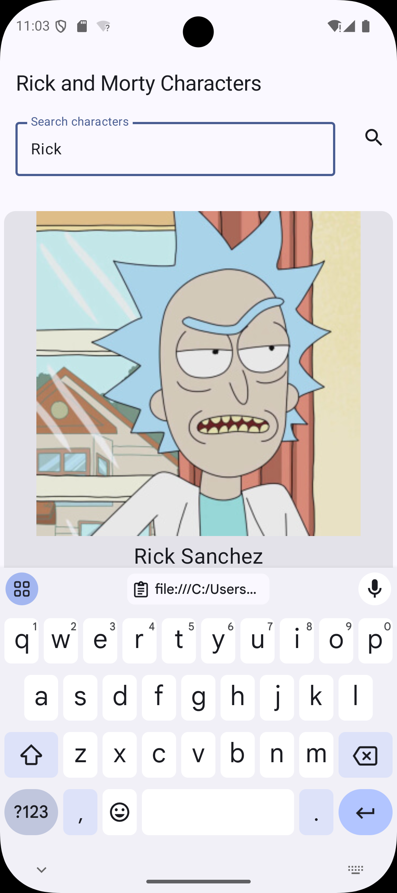
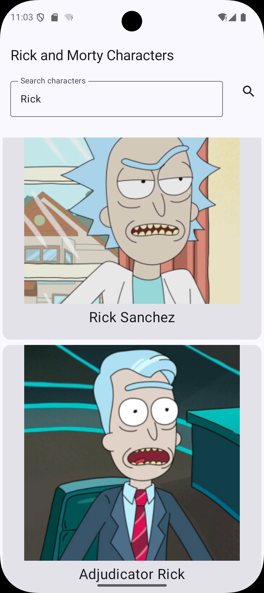
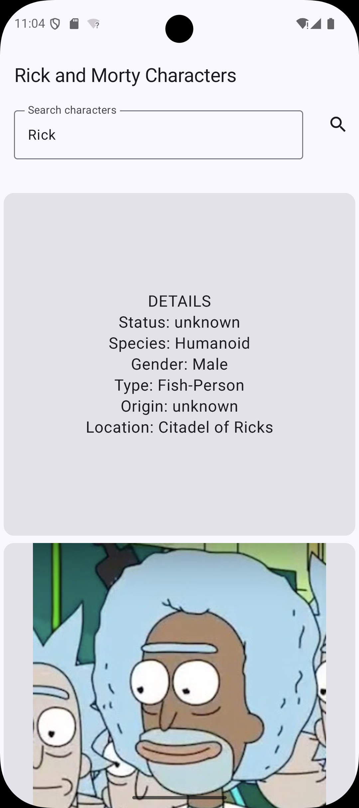

# Rick and Morty App

**Jetpack Compose** ve **Kotlin** ile geliştirilmiş, Rick and Morty API üzerinden karakter verilerini listeleyen, arayan ve interaktif 3D flip kart animasyonuyla karakter detaylarını gösteren bir Android uygulamasıdır.

Uygulama; REST API üzerinden asenkron veri çekme, MVVM mimarisi, state-driven UI tasarımı ve Jetpack Compose animasyonları gibi modern Android geliştirme pratiklerini bir araya getirir.

<p align="center">
  <a href="#özellikler">Özellikler</a> •
  <a href="#ekran-görüntüleri">Ekran Görüntüleri</a> •
  <a href="#kullanılan-teknolojiler">Teknolojiler</a> •
  <a href="#mimari">Mimari</a> •
  <a href="#öne-çıkan-teknik-konular">Teknik Konular</a> •
  <a href="#proje-yapısı">Proje Yapısı</a> •
  <a href="#api">API</a> •
  <a href="#projeyi-çalıştırma">Çalıştırma</a>
</p>

---

## Özellikler

- **Karakter Listeleme** — Rick and Morty API üzerinden karakter verilerinin çekilip listelenmesi.
- **Karakter Arama** — Girilen isme göre API üzerinden karakter araması yapılabilmesi.
- **3D Flip Kart Animasyonu** — Karakter kartına dokunulduğunda kartın 180° dönerek arka yüzündeki detayları göstermesi.
- **Detaylı Karakter Bilgisi** — Karakterin durumu, türü, cinsiyeti, kökeni ve mevcut konumu gibi bilgilerin görüntülenmesi.
- **State Yönetimi** — Loading, Success ve Error durumlarının ayrı ayrı ve tutarlı biçimde yönetilmesi.
- **Hata Yönetimi ve Tekrar Deneme** — Ağ veya API hatalarında kullanıcıya hata mesajı ve tekrar deneme seçeneği sunulması.
- **Uzaktan Görsel Yükleme** — Karakter görsellerinin Coil kullanılarak API üzerinden yüklenmesi.

---

## Ekran Görüntüleri

### Ana Ekran

Uygulamanın açılış ekranında karakterler API üzerinden alınarak listelenir.

<p align="center">
  
</p>

### Karakter Arama

Arama alanına karakter adı girilerek API üzerinden arama yapılabilir.

<p align="center">
  
</p>

### Arama Sonuçları

Girilen arama sorgusuna karşılık gelen karakterler listelenir.

<p align="center">
  
</p>

### Kart Detayı

Karakter kartına dokunulduğunda 3D flip animasyonu ile kartın arka yüzü görüntülenir. Arka yüzde karakterin detay bilgileri yer alır.

<p align="center">
  
</p>

---

## Kullanılan Teknolojiler

| Katman | Teknoloji | Açıklama |
|---|---|---|
| Dil | **Kotlin** | Android uygulama geliştirme dili |
| UI | **Jetpack Compose** | Deklaratif ve modern Android UI toolkit |
| UI Bileşenleri | **Material 3** | Modern Android tasarım bileşenleri |
| Asenkronluk | **Kotlin Coroutines** | Asenkron ve non-blocking işlemler |
| Ağ Katmanı | **Retrofit** | REST API iletişimi için type-safe HTTP istemcisi |
| Serileştirme | **Gson** | JSON verilerinin Kotlin modellerine dönüştürülmesi |
| Görsel Yükleme | **Coil** | Uzaktan görsellerin Compose içerisinde yüklenmesi |
| State Yönetimi | **ViewModel** | UI state ve veri akışının yönetilmesi |
| Mimari | **MVVM** | Model-View-ViewModel mimari yaklaşımı |

---

## Mimari

Proje **MVVM (Model-View-ViewModel)** mimari desenini takip eder.

Bu yapı sayesinde API iletişimi, veri modelleri, UI state yönetimi ve kullanıcı arayüzü sorumlulukları birbirinden ayrılmıştır.

### Veri Akışı

```text
Rick and Morty API
        ↓
     Retrofit
        ↓
   CharacterApi
        ↓
 CharacterViewModel
        ↓
 CharacterUiState
        ↓
 CharacterListScreen
   (Jetpack Compose)
```

### Katmanlar

#### Model

API'den gelen verileri temsil eden veri sınıflarını ve API servis tanımını içerir.

- `Character` — Tekil karakter modeli
- `CharacterResponse` — API'den dönen response modeli
- `CharacterApi` — Retrofit servis arayüzü

#### ViewModel

`CharacterViewModel`, API'den veri çekme işlemlerini Kotlin Coroutines üzerinden asenkron olarak yürütür.

API'den gelen sonuçlar `CharacterUiState` üzerinden UI katmanına aktarılır.

Ayrıca karakter arama sorgularının yönetimi de ViewModel içerisinde gerçekleştirilir.

#### View

Jetpack Compose ile oluşturulan `CharacterListScreen`, ViewModel tarafından sağlanan state'i gözlemler ve mevcut state'e göre arayüzü oluşturur.

- Loading durumunda `CircularProgressIndicator` gösterilir.
- Success durumunda karakterler `LazyColumn` içerisinde listelenir.
- Error durumunda hata mesajı ve tekrar deneme seçeneği gösterilir.

Kart etkileşimleri ve 3D flip animasyonu da UI katmanında yönetilir.

---

## UI State Yönetimi

Uygulamada UI'ın mevcut duruma göre şekillenmesini sağlayan state-driven bir yaklaşım kullanılmıştır.

```text
        Loading
           ↓
    ┌──────┴──────┐
    ↓             ↓
 Success         Error
                  ↓
             Tekrar Dene
```

---

## Karakter Arama

Karakter araması, istemci tarafında mevcut listeyi filtrelemek yerine doğrudan Rick and Morty API üzerinden gerçekleştirilir.

Kullanıcının girdiği arama değeri Retrofit içerisindeki `@Query("name")` parametresi aracılığıyla API isteğine eklenir.

API'den dönen sonuç ViewModel tarafından işlenerek `CharacterUiState` üzerinden ekrana aktarılır.

---

## 3D Kart Animasyonu

Karakter kartına dokunulduğunda kart 180° döndürülerek arka yüzündeki detay bilgileri gösterilir.

```text
0° ─────────────────────→ 180°

Ön Yüz                    Arka Yüz
Görsel + İsim             Karakter Detayları
```

Animasyon Jetpack Compose içerisinde aşağıdaki yapılar kullanılarak oluşturulmuştur:

- `animateFloatAsState`
- `graphicsLayer`
- `rotationY`
- `cameraDistance`

Kartın arka yüzünde aşağıdaki bilgiler gösterilir:

- Status
- Species
- Gender
- Type
- Origin
- Location

---

## Öne Çıkan Teknik Konular

Bu projede özellikle aşağıdaki Android geliştirme konuları üzerinde çalışılmıştır:

- REST API entegrasyonu ve veri alışverişi
- Retrofit ile HTTP istekleri
- Gson ile JSON veri dönüşümü
- Kotlin Coroutines ile asenkron işlemler
- MVVM mimarisi
- ViewModel ile state yönetimi
- State-driven UI tasarımı
- Jetpack Compose ve recomposition
- `remember` / `rememberSaveable` ile state saklama
- `LaunchedEffect` ile side-effect yönetimi
- `LazyColumn` ile listeleme
- Coil ile uzaktan görsel yükleme
- Jetpack Compose animasyonları
- `graphicsLayer` ile 3D dönüşümler
- Loading / Success / Error state yönetimi
- API üzerinden karakter arama

---

## Proje Yapısı

```text
com.example.rickandmortyapp
│
├── api
│   ├── CharacterApi.kt
│   └── RetrofitInstance.kt
│
├── model
│   ├── Character.kt
│   └── CharacterResponse.kt
│
├── ui
│   ├── CharacterListScreen.kt
│   └── theme
│       ├── Color.kt
│       ├── Theme.kt
│       └── Type.kt
│
├── viewmodel
│   └── CharacterViewModel.kt
│
└── MainActivity.kt
```

---

## API

Uygulamada karakter verilerini almak için **Rick and Morty API** kullanılmaktadır.

API üzerinden karakterlerin aşağıdaki bilgileri alınarak uygulama içerisinde gösterilir:

- İsmi
- Görseli
- Durumu
- Türü
- Cinsiyeti
- Kökeni
- Konumu

---

## Projeyi Çalıştırma

### Gereksinimler

- Android Studio
- JDK 11 veya üzeri
- Android SDK
- İnternet bağlantısı

### Kurulum

1. Repository'yi klonlayın:

```bash
git clone https://github.com/Zeynep-Bayram/RickAndMortyApp.git
```

2. Projeyi Android Studio ile açın.

3. Gradle senkronizasyonunun tamamlanmasını bekleyin.

4. Bir Android emülatörü veya fiziksel Android cihaz bağlayın.

5. Uygulamayı çalıştırın.

> Uygulamanın karakter verilerini API üzerinden alabilmesi için cihazın internet bağlantısının olması gerekir.

---

## Geliştirme Amacı

Bu proje, modern Android geliştirme yaklaşımını pratikte deneyimlemek amacıyla geliştirilmiştir.

Özellikle **Jetpack Compose, MVVM, Retrofit, Kotlin Coroutines, ViewModel, UI state yönetimi ve Compose animasyonları** üzerine odaklanılmıştır.

Proje geliştirilirken yalnızca çalışan bir arayüz oluşturmak yerine, veri akışının ve UI state'lerinin nasıl yönetildiği de ele alınmıştır.

---
